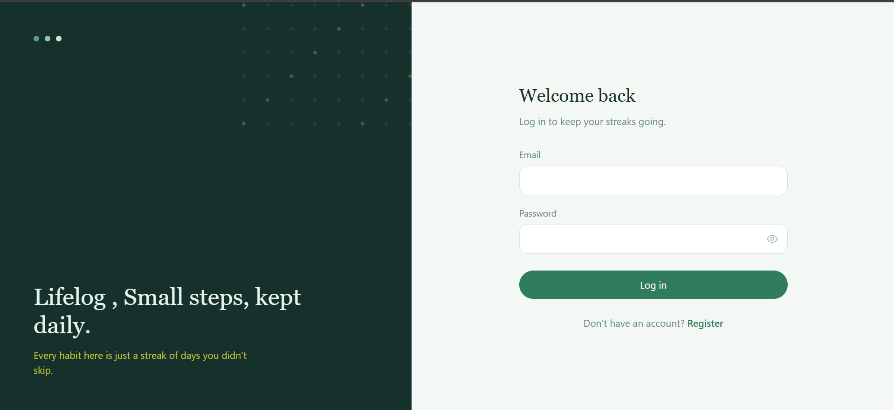
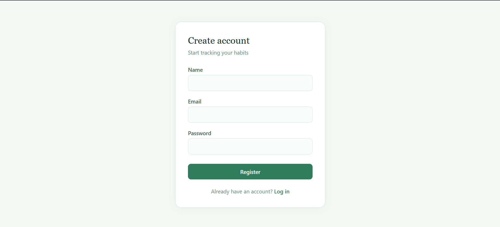
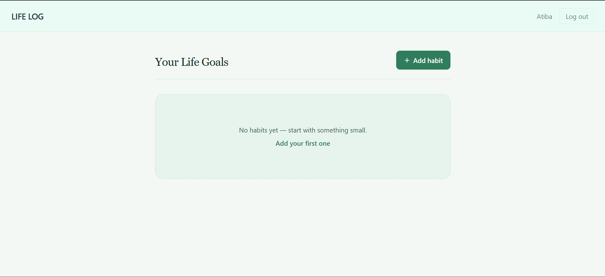
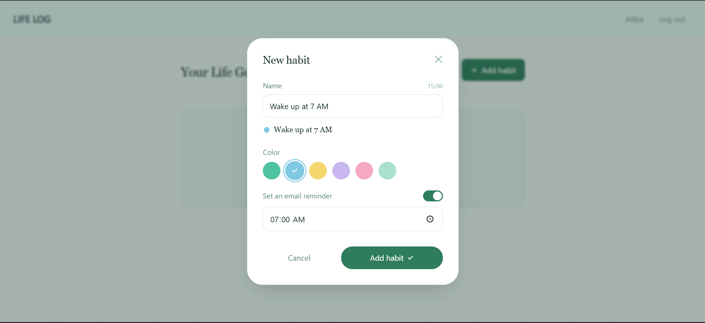
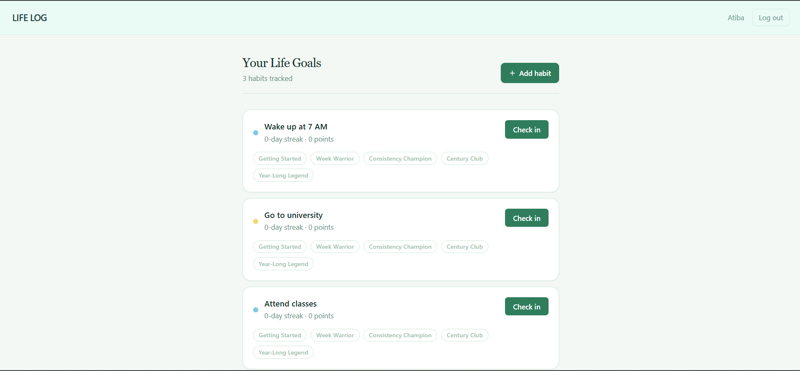
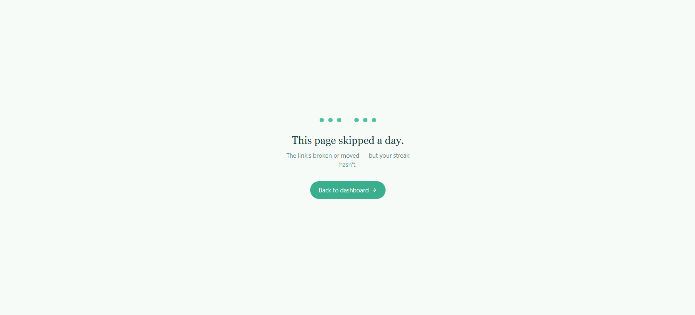

<p align="center">
  
</p>


<p align="center">
  A full-stack habit tracker built with the MERN stack.
</p>

<p align="center">
  Track your habits, stay consistent, and see your progress day by day.
</p>

<p align="center">
  <strong>"Small steps, kept daily."</strong>
</p>

## ✨ Features

* 🔐 **Authentication** — JWT-based login and registration with protected routes
* ✅ **Habit Dashboard** — Add, view, and update habits
* 📊 **Progress Tracking** — See daily completion counts and progress at a glance
* 📱 **Responsive UI** — Works across desktop and mobile screens
* 🌙 **Modern Interface** — Dark UI with neon accents
* ⚡ **REST API** — Express-based backend API
* 🗄️ **MongoDB** — Persistent data storage using Mongoose
* ✅ functionality- send email reminders

---
## Screenshots

### Login


### Register


### Dashboard


### Add habit


### Habit check-in


### Badges



### Video Demo

https://github.com/user-attachments/assets/b9b71ae3-8366-4a4d-b509-b8377c0dd049

## 🛠️ Tech Stack

### Frontend

* React
* React Router
* Axios
* Tailwind CSS

### Backend

* Node.js
* Express.js
* MongoDB
* Mongoose
* JWT

---

## 📁 Project Structure

```text
Life-Log/
├── client/
│   ├── src/
│   │   ├── api/
│   │   ├── components/
│   │   ├── context/
│   │   ├── pages/
│   │   └── App.jsx
│   └── package.json
│
└── server/
    ├── models/
    ├── routes/
    ├── controllers/
    ├── middleware/
    └── server.js
```

---

## 🚀 Getting Started

### Prerequisites

Make sure you have installed:

* [Node.js](https://nodejs.org/) — v18+
* MongoDB Atlas or a local MongoDB instance
* Git

### 1. Clone the repository

```bash
git clone https://github.com/Atibayounus/Life-Log.git
cd Life-Log
```

### 2. Install dependencies

Install backend dependencies:

```bash
cd server
npm install
```

Install frontend dependencies:

```bash
cd ../client
npm install
```

### 3. Configure environment variables

Create a `.env` file inside the `server/` directory:

```env
MONGO_URI=your_mongodb_connection_string
JWT_SECRET=your_jwt_secret
PORT=5000
```

### 4. Start the backend

```bash
cd server
npm run dev
```

### 5. Start the frontend

Open another terminal:

```bash
cd client
npm run dev
```

The application should now be available at:

```text
Frontend: http://localhost:5173
Backend:  http://localhost:5000
```

---

## 🔌 API Endpoints

| Method | Endpoint             | Description          |
| ------ | -------------------- | -------------------- |
| POST   | `/api/auth/register` | Create a new account |
| POST   | `/api/auth/login`    | Log in a user        |
| GET    | `/api/habits`        | Get all habits       |
| POST   | `/api/habits`        | Create a habit       |
| PATCH  | `/api/habits/:id`    | Update a habit       |

---

## 🗺️ Roadmap

* [ ] Habit streaks
* [ ] Habit history view
* [ ] Reminders & notifications
* [ ] Dark/light theme toggle
* [ ] Improved progress analytics

---

## 📄 License

This project is open source and available under the **MIT License**.

<p align="center">
  
</p>
